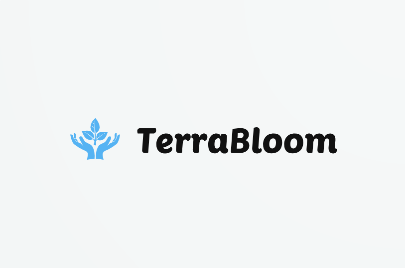

<div align="center">

  

  # 🌿 TerraBloom

  **Sustainable Living Platform | AI-Powered Eco Commerce**

  *Live Greener, Bloom Brighter*

  [](https://github.com/Himil192/TerraBloom/actions)
  [](https://reactjs.org/)
  [](https://tailwindcss.com/)
  [](https://firebase.google.com/)
  [](LICENSE)

  [🌐 View Live Demo](https://terrabloom-8dc91.web.app/) • [📖 Documentation](#features) • [🚀 Getting Started](#installation)

  ---

</div>

## 🌍 Our Mission

**TerraBloom** is more than an e-commerce platform — it is a movement towards sustainable living. We are building an ecosystem where every purchase plants a tree, every product is plastic-free, and technology serves the planet.

> *"We believe in a world where commerce and conservation go hand in hand. Every transaction on TerraBloom is a step towards a greener future."*

---

## ✨ Features

### 🛒 Eco Commerce
- **100% Plastic-Free Packaging** — Every order ships in compostable materials
- **Carbon Neutral Delivery** — We offset every shipment carbon footprint
- **Curated Sustainable Products** — Hand-picked eco-friendly items
- **Tree Planting Program** — One tree planted with every order

### 📝 Smart Blog Platform
- **AI-Powered Content Creation** *(Coming Soon)* — Generate eco-tips and articles with AI
- **Sustainability Guides** — Expert-curated content on green living
- **Climate Action Articles** — Stay informed about environmental issues

### 👤 User Experience
- **Beautiful Glassmorphism UI** — Modern, clean design with smooth animations
- **Dark/Light Mode** — Eye-comfortable themes for any time of day
- **Mobile-First Design** — Perfect experience on any device
- **Real-time Order Tracking** — Know exactly where your eco-goodies are

### 🔧 Admin Dashboard
- **Product Management** — Easy catalog management with AI-assisted descriptions *(Coming Soon)*
- **Order Analytics** — Beautiful charts and insights
- **Content Management** — Blog post editor with AI suggestions *(Coming Soon)*
- **Customer Insights** — Understand your eco-community

---

## 🚀 Future Roadmap

### 🤖 AI Integration (Phase 2)
| Feature | Description | Status |
|---------|-------------|--------|
| **AI Product Descriptions** | Auto-generate compelling, SEO-optimized product descriptions | 🔜 Coming Soon |
| **Smart Blog Writer** | AI-assisted article generation with eco-fact checking | 🔜 Coming Soon |
| **Eco Impact Calculator** | Show customers their personal environmental impact | 📋 Planned |
| **AI Recommendations** | Personalized product suggestions based on eco-preferences | 📋 Planned |
| **Chatbot Assistant** | 24/7 eco-living guidance and product recommendations | 📋 Planned |

### 🌱 Sustainability Goals
- [ ] Carbon-negative operations by 2026
- [ ] 1 million trees planted through platform orders
- [ ] Zero-waste supply chain certification
- [ ] Community-driven sustainability challenges

---

## 🛠️ Tech Stack

### Frontend
| Technology | Purpose | Version |
|------------|---------|---------|
| **React.js** | UI Framework | 19.x |
| **Vite** | Build Tool | 6.x |
| **TailwindCSS** | Styling | 4.x |
| **React Router** | Navigation | 7.x |
| **Lucide React** | Icons | Latest |

### Backend & Services
| Technology | Purpose | Version |
|------------|---------|---------|
| **Firebase Auth** | Authentication | 11.x |
| **Cloud Firestore** | Database | 11.x |
| **Cloud Storage** | File Storage | 11.x |
| **GitHub Actions** | CI/CD | - |

---

## 🏁 Getting Started

### Prerequisites
- Node.js 18+ installed
- npm or yarn package manager
- Firebase account (for backend services)

### Installation

```bash
# Clone the repository
git clone https://github.com/Himil192/TerraBloom.git

# Navigate to project directory
cd TerraBloom

# Install dependencies
npm install

# Start development server
npm run dev
```

### Environment Setup

Create a `.env` file in the root directory:

```env
VITE_FIREBASE_API_KEY=your_api_key
VITE_FIREBASE_AUTH_DOMAIN=your_auth_domain
VITE_FIREBASE_PROJECT_ID=your_project_id
VITE_FIREBASE_STORAGE_BUCKET=your_storage_bucket
VITE_FIREBASE_MESSAGING_SENDER_ID=your_sender_id
VITE_FIREBASE_APP_ID=your_app_id
```

### Build for Production

```bash
npm run build
npm run preview
```

---

## 📁 Project Structure

```
TerraBloom/
├── src/
│   ├── components/          # Reusable UI components
│   │   ├── AdminDashboard/  # Admin panel components
│   │   ├── NavBar/          # Navigation components
│   │   ├── Profile/         # User profile components
│   │   └── ui/              # Generic UI components
│   ├── pages/               # Page components
│   │   ├── admin/           # Admin dashboard pages
│   │   └── ...              # Public pages
│   ├── services/            # Firebase/API services
│   ├── context/             # React context providers
│   ├── hooks/               # Custom React hooks
│   ├── utils/               # Utility functions
│   ├── assets/              # Images, fonts, etc.
│   ├── theme/               # Theme configuration
│   ├── App.css              # Global styles
│   ├── App.jsx              # Main app component
│   └── main.jsx             # Entry point
├── public/                  # Static assets
├── .env.example             # Environment template
├── package.json
└── vite.config.js
```

---

## 🤝 Contributing

We welcome contributions from the eco-community! Here is how you can help:

### Development Workflow
1. **Fork** the repository
2. **Create** a feature branch (`git checkout -b feature/amazing-feature`)
3. **Commit** your changes (`git commit -m Add amazing feature`)
4. **Push** to the branch (`git push origin feature/amazing-feature`)
5. **Open** a Pull Request

---

## 📜 License

This project is licensed under the **MIT License** — see the [LICENSE](LICENSE) file for details.

---

## 🙏 Acknowledgments

### Design Inspiration
We draw inspiration from the amazing designs shared by the community on [Dribbble](https://dribbble.com/). The glassmorphism aesthetic and smooth animations were shaped by these creative works.

### Special Thanks
- 🌳 **Our Planet** — For giving us a reason to build this
- 👥 **The Eco Community** — For inspiring sustainable innovation
- 💚 **Open Source Contributors** — For making this project better every day

---

## 📬 Connect With Us

<div align="center">

  [](https://github.com/Himil192)
  [](https://www.linkedin.com/in/himil-prajapati/)

</div>

---

<div align="center">

  ### 🌿 *Every purchase on TerraBloom plants a tree. Join us in making the world greener.* 🌿

  **Made with 💚 by [Himil192](https://github.com/Himil192)**

  © 2026 TerraBloom. All rights reserved.

</div>